[toc]

## 0. 팀 구성

- **팀장**: 이상우 
- **팀원**: 임지환 


## 1. 개발환경

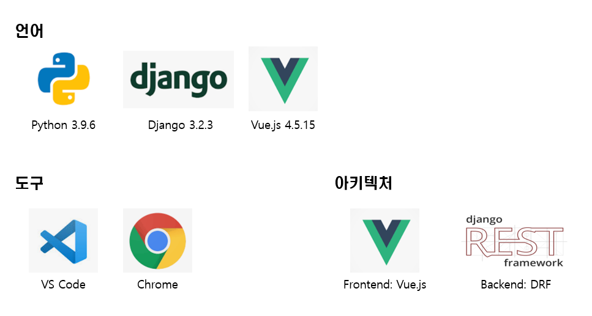


## 2. 기획 단계

**실제 소요 기간: 11월 12일(금) ~ 11월 17일(수)**

- **컨셉 회의 및 전체 일정 계획**  -`Notion`, `Figma` 활용

  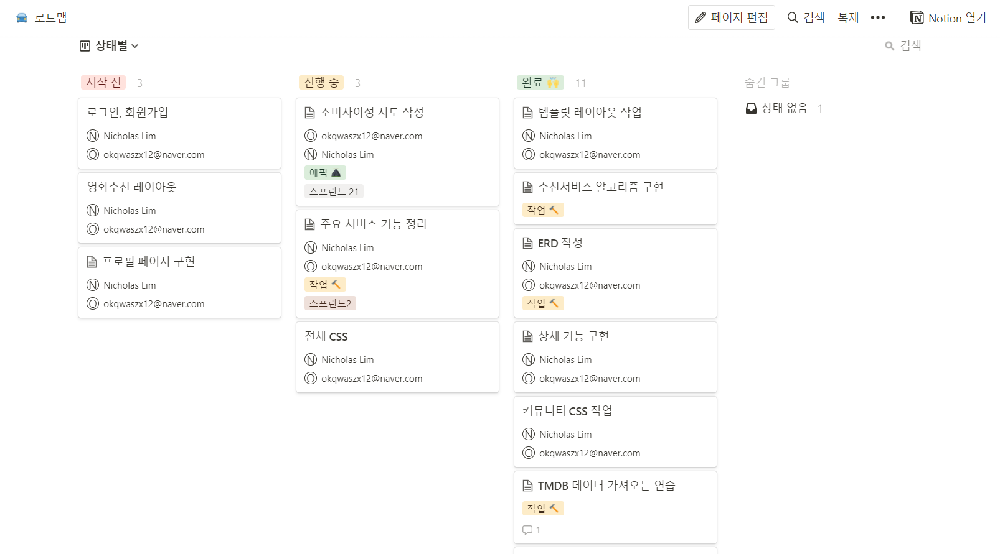


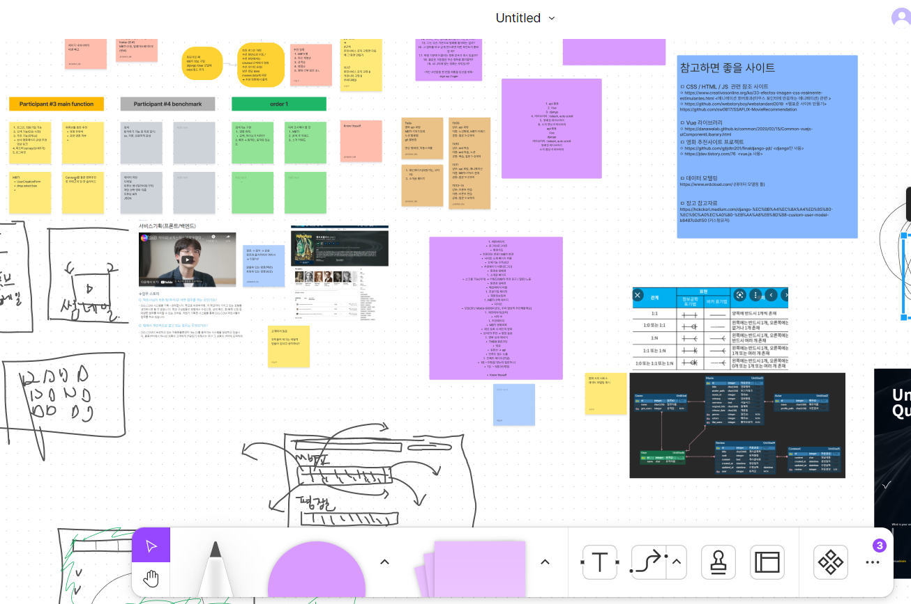


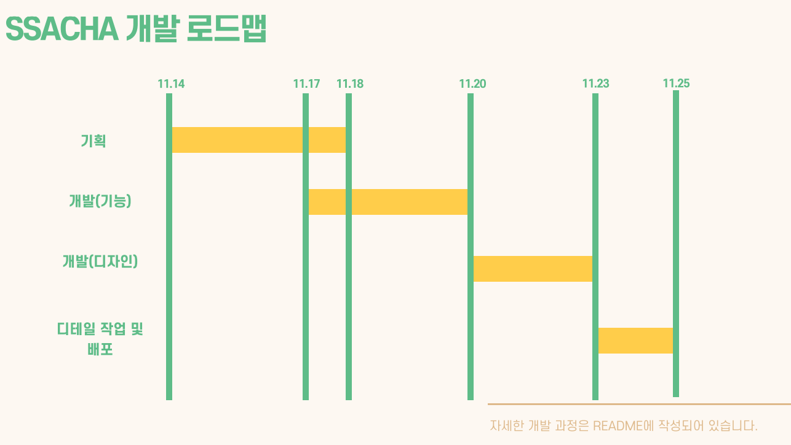

영화 추천 서비스의 컨셉은 다음과 같은 기준을 잡고 회의를 진행했습니다.

```xml
1.  현재 OTT사이트에서는 존재하지 않으면서, 우리 개인이 보다 더 공감할 수 있어야 함
2.  주어진 개발 일정 내에 완성도 있게 구현이 가능할 만큼 너무 복잡하지는 않아야 함
3.  가볍다는 느낌이 아닌 재치있는 느낌을 주어야 함
```

 회의 과정에서 임지환 학생의  **MBTI 아이디어**가 채택,  아래와 같은 세부 카테고리를 설정했습니다.

```xml
1. 나의 MBTI에 맞는 영화
2. 나의 애인 혹은 썸에게 맞는 영화 
   (해당 값은 선택사항이며, 입력하지 않은 경우는 MBTI 궁합도를 기준으로 가장 높은 궁합도를 갖는 MBTI를 디폴트값으로 설정)
3. 나와 애인 혹은 썸이랑 같이 보면 맞는 영화
4. 나와는 잘 맞진 않지만 훌륭한 영화 (MBTI 궁합도를 기준으로 가장 낮은 궁합도를 갖는 MBTI에 맞는 영화)
```


- **DB 모델링 **- ERD Cloud 활용

  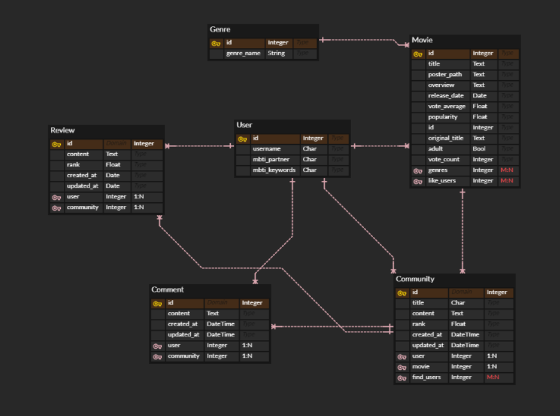


- **화면 레이아웃 구성** -카카오 오븐 활용

​                🔑카카오 오븐을 활용하여, 구성이 필요한 페이지의 레이아웃 작성을 했습니다.

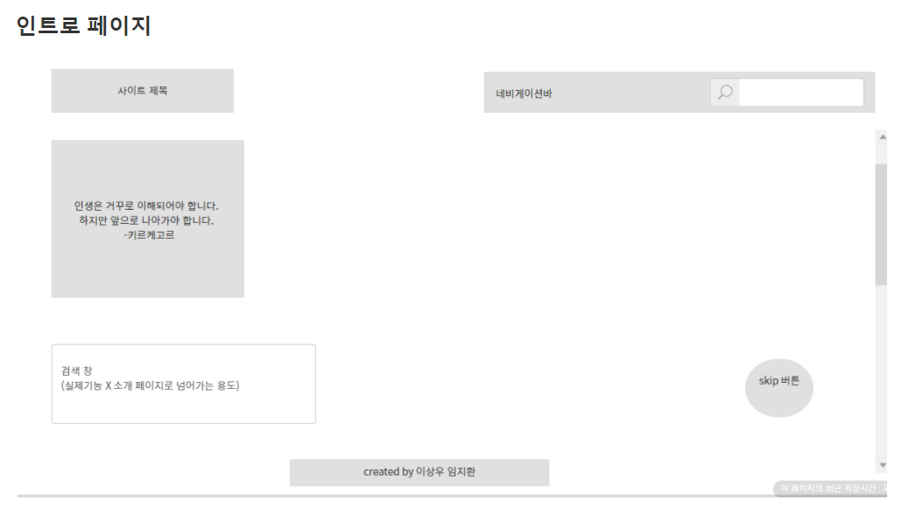

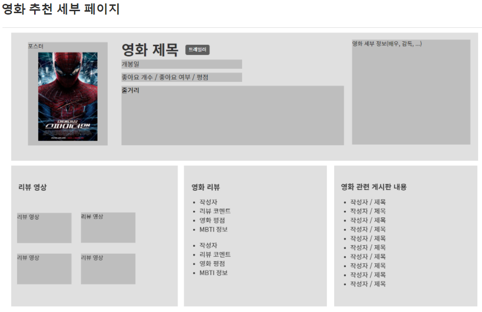


## 3. 개발 과정

**실제 소요 기간:  11월 18일(목) ~ 11월 24일(수)**


- **11월 18일(목)**
  
     특이 사항: 
  
  1. 협업 체계로 진행
  
    2. 기능 구현에만 집중하기로 함. 디자인적 요소는 완전 배제
  
       
  
  - 작업 내용
    - Django, Vue.js 기본 작업 환경 구축
    - Django: 
      - User, Movie, Genre 모델 구현 및 DB 저장
      - 추천 서비스 알고리즘 구현 
      -  회원가입 및 로그인, 로그아웃 기능 urls.py, views.py 작성 
    - Vue:
      - 회원가입 및 로그인 / 로그 아웃 폼 작성 및  요청 기능 구현 후 출력 확인
      
        
  - 작업 결과:

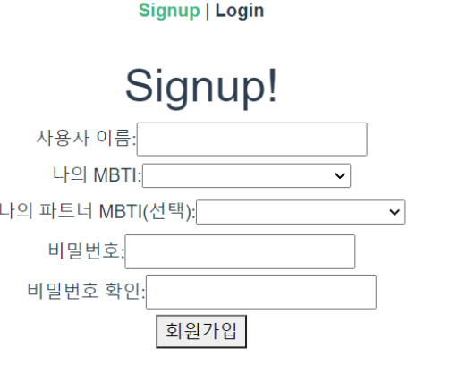


- **11월 19일(금)** 
  
  - 작업 내용:
    - Django:
      - Comment 모델 작성
      - 추천서비스 알고리즘을 통한 영화 추천 페이지 기능 urls.py, views.py 작성
      - 영화 상세 정보 기능 urls.py, views.py 작성
    - Vue:
      - 추천 페이지 및 상세페이지 요청 기능 및 출력 확인
      
        
  - 작업 결과:

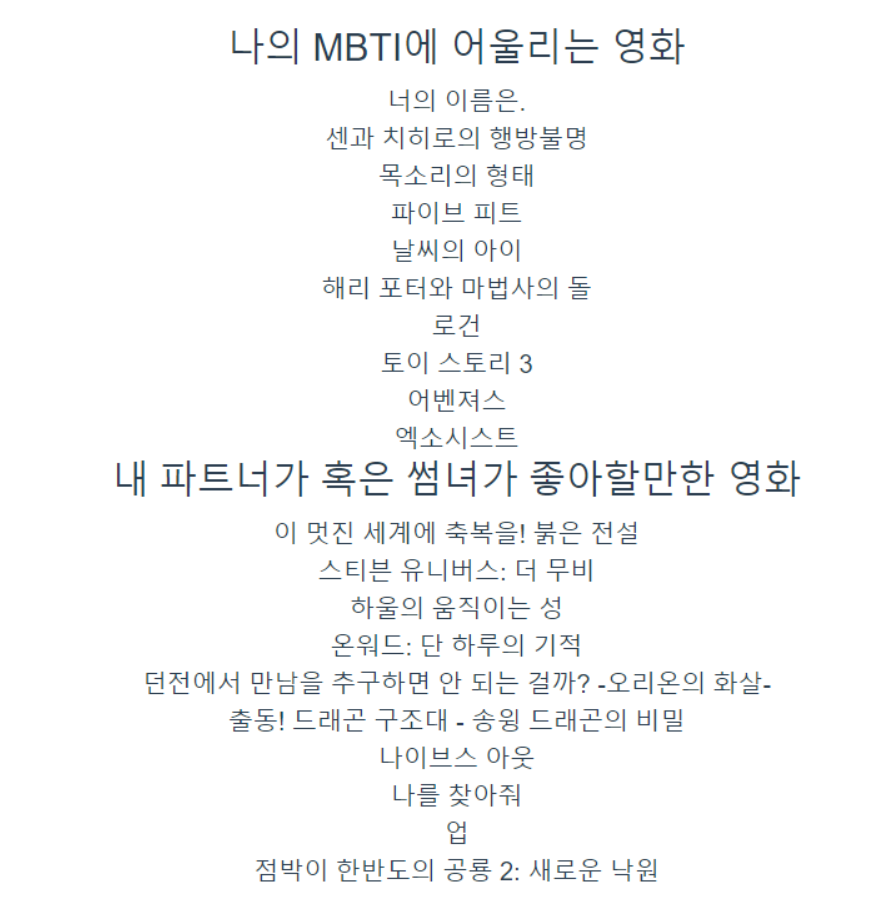

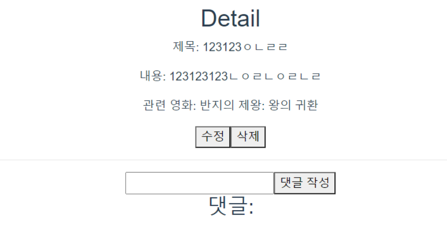

- **11월 20일(토)**
  - 작업 내용:
    - Django: 
      - Community, Review 모델 작성
      - 영화 커뮤니티 CRUD 관련 urls.py, views.py 작성
      - 영화 상세페이지 좋아요 기능 urls.py, views.py 작성
      - 단순 영화 검색 기능 urls.py views.py 작성
    - Vue
      - Youtube 영상 요청 기능 구현 및 출력 확인 
      - 영화 상세페이지 좋아요 기능 구현 및 출력 확인
      - 커뮤니티 CRUD 요청 기능 구현 및 출력 확인
      - 영화 검색 form 작성 및 출력 확인

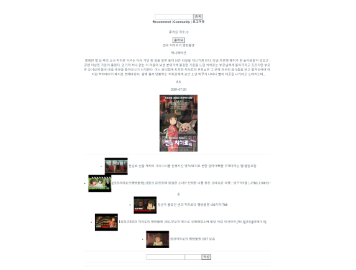

- **11월 21일(일)**

  ​	특이사항:  기본 기능 구현 완료

  - 작업 내용 :

    - Django:
      - 프로필 urls.py, views.py 작성
      - 영화 상세페이지 리뷰 urls.py, views.py 작성
      - 커뮤니티 게시글 즐겨찾기 기능 urls.py, views.py 작성
    - Vue:
      - 프로필 페이지 요청 기능 구현 및 출력 확인
      - 커뮤니티 게시글 즐겨찾기 요청 기능 구현 및 출력 확인
      - Intro 페이지 및 네비게이션 바 구현

    

- **11월 22일(월)**

  특이 사항:   1.  레이아웃 설정 및  디자인 작업 시작  

  ​			         2. 기존 협업 체계에서 분업체계로 전환

  - 작업 내용

    - 이상우: 
      - 영화 추천 페이지 carousel 적용 및 디자인 작업

    - 임지환: 
      - Login, Signup, 커뮤니티 페이지 디자인 작업

    

- **11월 23일(화)** 

  특이 사항:  1. 기본 작업 완료 후, 디테일 보완 및 오류 점검 진행 이 부분은 다시 협업 진행

  ​                   2.  MBTI 알고리즘에 대한 교수님 피드백 반영, 회원 가입 과정에서 키워드 선택 form 추가	

  - 작업 내용
    - 이상우: 
      - 영화 상세 페이지, 단순 검색 결과 페이지 디자인 작업
      - 페이지 효과 적용
    - 임지환: 
      - 프로필 페이지, 커뮤니티 상세글 페이지, mbti 설명 페이지 디자인 작업
      - 좋아요, 즐겨찾기 아이콘 구현 (Fontawsome 활용)
      - alert창 커스텀 작업 (Sweetalert2 활용)
    - 추가 작업
      - MBTI 알고리즘 개선 작업
        - Signup 과정에서 keyword 검색 과정 추가
        - Django에서 알고리즘 보완
      - 페이지 별, 배경 이미지 설정
      - 오타 점검 및 추가 디버깅 진행


- **11월 24일(수):**
  - 작업 내용
    - 배포 작업 진행
      - HTTP 단계 까지만 배포 완료.
    - ppt 제작 및 README 작성을 위한 사전 회의 
  - 배포 HTTP url: `http://3.145.29.146:8080/`


## 4. 작업 결과

​	*전체적으로 UX적인 고민을 기반으로 작업을 진행하였습니다.*🎨

- **Intro페이지1**

  접속시 초기 화면이며, 네비게이션바와 인트로 페이지로 구성하였고 임의의 문구를 아래 언더바에 입력시,

  다음 Intro 페이지로 넘어가도록 이벤트 구현하였습니다.

  Intro 페이지를 통해 `우리 자신에 대해 보다 온전히 이해할 수 있어야 한다` 라는 메시지를 던져주고 싶었고,

  우리의 로고 역시 우리 자신을 들여다 보는 창이라는 의미로서 사각형 형태의 로고를 사용하였습니다.

  네비게이션 바는 기본적으로 다음과 같이 출력 되며

  1. 로그인 상태일 경우: Recommend, Community, Profile, MBTI, Logout, 서치바
  2. 비로그인 상태일 경우: Signup, Login, MBTI 서치바

  MBTI의 경우는 로그인 여부와 상관없이 확인 가능하나, 서치바는 로그인 경우에만 사용 가능합니다.

  좌측 상단의 사이트 로고는 유저가 로그인 상태일 경우에는 Recommend 페이지, 

  비로그인일 경우에는 Intro 페이지로 링크 되어 있음

  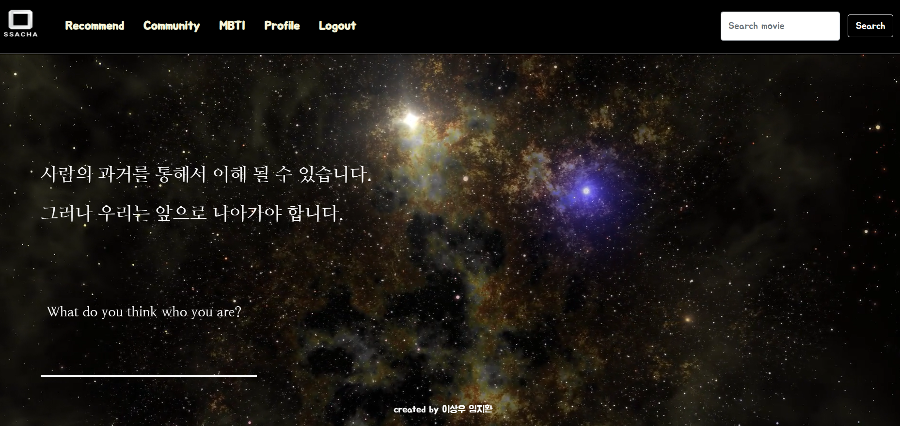

  

- **Intro페이지 2**

  초기 화면에서 임의이 텍스트를 언더바에 입력할 경우 이동하는 페이지로, 특정 문장들을 `<marquee>`태그를 통해 오토 스크롤 애니메이션을 적용했습니다.  

  `<marquee>태그의 호환성은 현재 safari와 IE 외에는 문제가 없는것으로 확인하였으며, safari와`

  `IE에서도 이 프로젝트에서 사용하는 속성에서는 호환성 문제가 없을것으로 판단하여 사용`

  이후, 사이트 로고와 회원가입, 로그인 링크가 출력되는 화면으로 고정됩니다.

  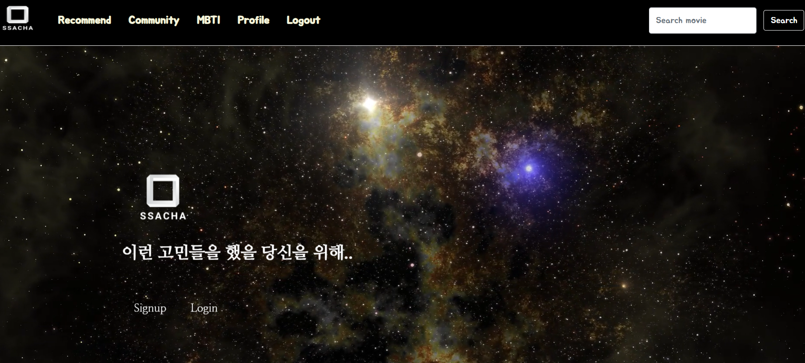


- **MBTI 페이지**

  사이트의 컨셉을 살리기 위해 추가한 페이지로, 로그인 여부와 상관 없이 조회 가능하며,

  각 MBTI별 링크는 해당 MBTI에 대한 설명 페이지로 링크를 걸어 두었습니다.

  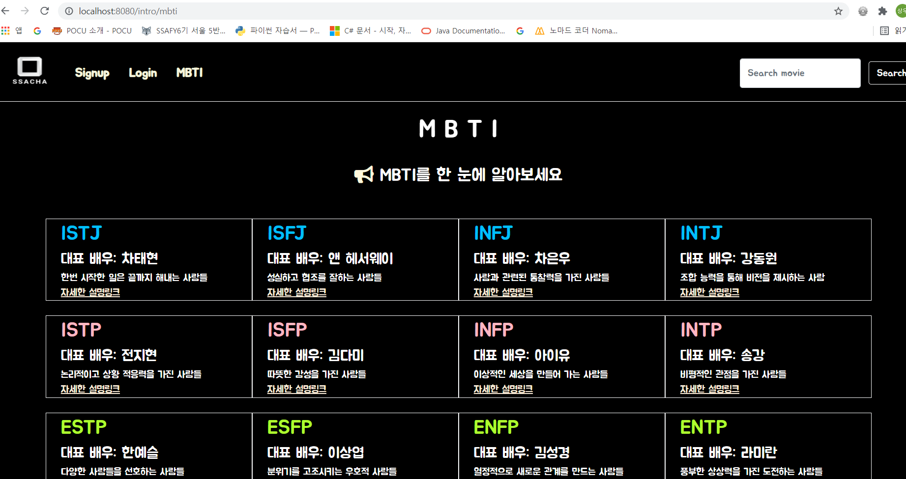


- **Signup 페이지 및 Login 페이지**

  본인의 MBTI의 경우 우리 프로젝트에서 주어지는 keyword중 4개를 선택해야 하며, 해당 갯수를 강제 하였음 해당 keyword는 배열로 주어지고, 선택한 keyword의 배열을 str으로 합치는 작업을 구현하기 위해  watch를 활용했습니다.

  ```vue
  <div v-if="mbtiDict">
      <span v-if="credentials.mbti">
          <div>
              <h5 class="text-center mt-3">끌리는 단어를 4개 선택해 주세요</h5>
              <div class="d-flex col-12">
                  <form action="was-validated py-3">
                      <div v-for="(keyword, idx) in mbtiDict[credentials.mbti]['keyword']"
                           :key="idx" class="form-check ms-3" style="display: inline-block"
                           >
                          <input type="checkbox" :id="keyword" 
                                 :value="idx" class="pointer form-check-input" v-model="checkedValues"
                                 >
                          <label :for="keyword" class="pointer form-check-label">{{ keyword }}</label>
                      </div>
                  </form>
              </div>
          </div>
      </span>
  </div> 
  
  
   ...
     watch: {
      checkedValues: function (){
        let temp = ""
        for (let i = 0; i < this.checkedValues.length; i++){
          temp += this.checkedValues[i]
        }
        this.credentials.mbti_keywords = temp
      }
    }
  ```

  

  파트너 MBTI의 경우 선택사항이며, 미선택 시에는 MBTI 궁합도를 기준으로 가장 높은 궁합을 갖는

  MBTI 값이 디폴트 값으로 설정 되도록 구현 하였습니다.

  로그인 페이지에서 특이사항이 하나 존재하는데, 비밀번호 input태그에 설정한

   `@keyup.enter="login"` 을 통해, 엔터를 입력해도 로그인은 실제로 진행 되나 

  다시 Login화면으로 돌아가는 경우가 빈번히 존재합니다. 이에 대해서 명확한 원인을 파악하지 못해

  버튼 클릭을 통한 로그인으로 부탁드립니다

  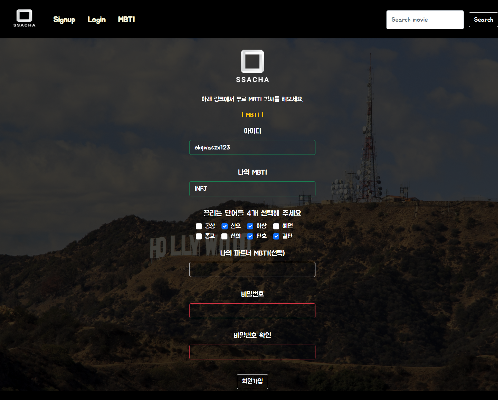

  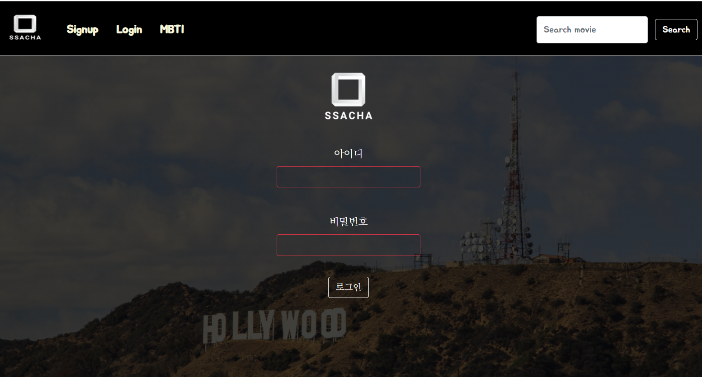

  

- **Recommend 페이지**

  로그인 이후와 로그인 상태에서 좌측 상단 로고 클릭하는 경우  이동하는 페이지입니다.

  a) 나의 MBTI에 맞는 영화 

  b) 파트너의 MBTI가 좋아할 영화  

  c) 파트너와 함께 보면 좋을 영화 

  d) 나와 맞진 않지만 보면 좋을 영화

  이렇게 크게 네가지 카테고리로 추천 서비스가 이루어지며 d)의 경우는 Signup 과정에서 파트너 MBTI를 미선택할 경우, 디폴트값으로 최상위 궁합도를 갖는 MBTI를 설정한것과 유사하게, 최악의 궁합도를 갖는 MBTI의 추천 영화를 반환하도록 구현하였습니다.

  MBTI_DICT라는 기본 MBTI 별 장르와, keyword들을 미리 작성을 해두었으며,

  Signup 과정에서 입력한 MBTI 정보와, keyword들이 User 모델 필드에 저장 됨, 이후 Django에 

  미리 `get_my_movies(mbti, keywords)` 와 `get_other_movies(mbti)` 를 작성하였으며,

  MBTI별 잘 맞는 장르 1개와,  전자의 경우는 내가 직접 선택한 keyword들이 인자로 전달하여, 

  후자의 경우는 미리 갖고있는 MBTI_DICT 데이터에서 무작위로 선택 되어, 아래와 같은 쿼리셋 필터링을 통해 우리가 원하는 알고리즘에 맞는 쿼리셋을 반환하는 구조입니다.

  ```python
  # 내 mbti 추천
  def get_my_movies(mbti, keyword_idx):
      genre_name = MBTI_DICT[mbti]['genre']
      keywords = []
      for idx in keyword_idx:
          keywords.append(MBTI_DICT[mbti]['keyword'][int(idx)])
      (key1, key2, key3, key4) = keywords
      #장르 영화
      genre = Genre.objects.get(name=genre_name)
      genre_movies = genre.movie_set.all()
      # 키워드 영화
      keyword_movies = Movie.objects.filter(
          Q(overview__contains=key1) |
          Q(overview__contains=key2) |
          Q(overview__contains=key3) |
          Q(overview__contains=key4))
      result = genre_movies | keyword_movies    
      # 둘의 합산값 return
      return result    
  
  # mbti별 추천무비 쿼리셋 반환 메서드
  def get_other_movies(mbti):
      genre_name = MBTI_DICT[mbti]['genre']
      (key1, key2, key3, key4) = random.sample(MBTI_DICT[mbti]['keyword'], 4)
      genre = Genre.objects.get(name=genre_name)
      #장르 영화
      genre_movies = genre.movie_set.all()
      # 키워드 영화
      keyword_movies = Movie.objects.filter(
          Q(overview__contains=key1) |
          Q(overview__contains=key2) |
          Q(overview__contains=key3) |
          Q(overview__contains=key4))
      result = genre_movies | keyword_movies
      # 둘의 합산값 return
      return result
  ```

  

  이후 Recommend 뷰함수에서 이 메서드들을 활용하여 아래 카테고리에 맞는 영화를 직렬화하여 반환하는 구조  `Vue carousel`을 활용하여

  Carousel 애니메이션을 구현하였으며, 각 포스터에는 호버 애니메이션 효과를 적용 하였습니다.
  
  간단한 영화 정보와, 나의 좋아요 여부를 확인 가능하며, 해당 포스터를 클릭할 경우, 상세 영화 페이지로 이동할 수 있습니다.
  
  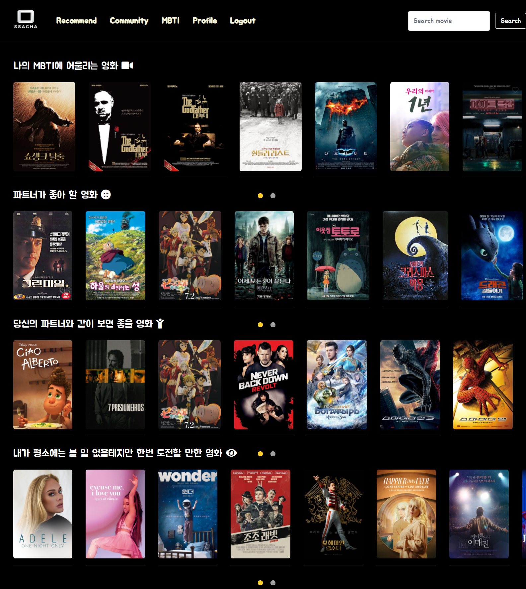


- **영화 상세 페이지**

  기본적인 영화 상세 정보와 함께, 좋아요와 리뷰를 할 수 있습니다. 리뷰에는 내용과 함께 만족도를 작성하게 되어 있으며,

  이는 '평점'의 개념으로 추후 서비스 개선에서 알고리즘을 강화하는데 사용할 목적으로 구현했습니다. 

  추가적으로 해당 영화와 관련된 유튜브 리뷰 영상을 같이 제공합니다.

  만족도의 경우 Django에서 아래와 같이  `MinValueValidato` `MaxValueValidator`를 활용, 최솟값과 최댓값을 지정해 두었습니다.

  유뷰브 영상을 클릭할 경우, 유튜브 영상 구역에서 모달창으로 띄워지며 우측 상단의 X 버튼을 클릭할 경우 해제 가능합니다.

  ```python
  rank = models.FloatField(validators=[MinValueValidator(0), MaxValueValidator(10)])
  ```

  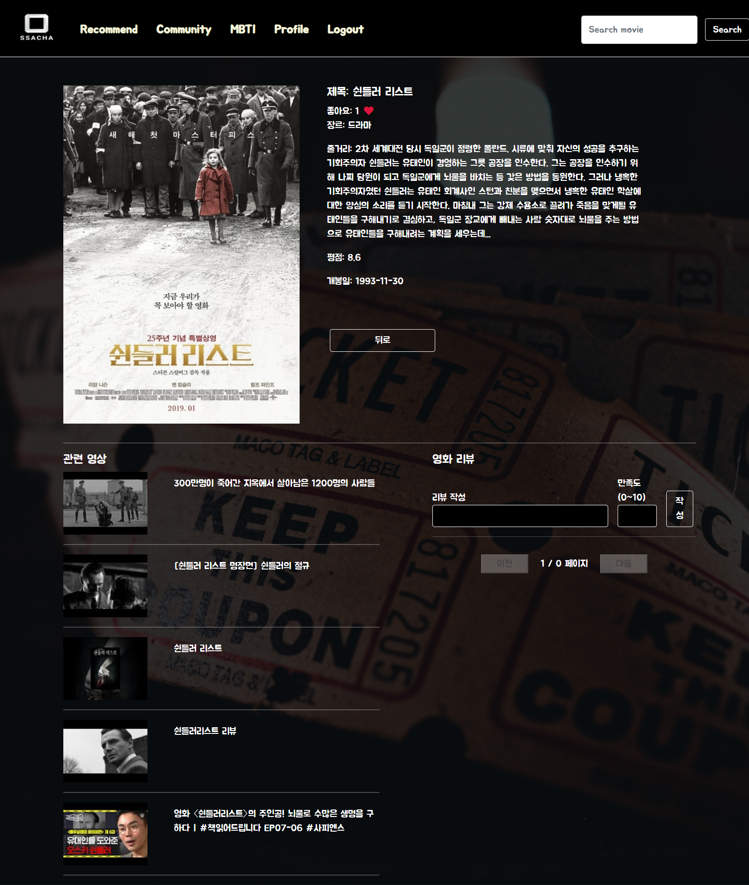
  
  

- **커뮤니티 (전체 / 상세페이지 포함)**

  영화에 대한 자유로운 게시글을 작성하는 공간으로,  작성과 수정 과정에서 영화 제목을 작성하는 부분 자동 완성 기능을 적용하였습니다.

  ```vue
  <div class="autocomplete disabled">
      <span v-if="!movie_title">
          <div
               @click="addMovie(res.title)"
               class="pointer"
               v-for="(res,idx) in result"
               :key="idx"
               >{{ res.title }}</div>
      </span>
  </div>
  ...
  export default {
    name: 'CreateCommunity',
    data: function (){
      return {
        title: null,
        content: null,
        movie_title: null,
        movie_titles: [],
        movieTitleInput: null,
        rank: null,
        result: null,
      }
    },
     ...
      addMovie: function (movie){
        this.movie_title = movie
        this.movieTitleInput = movie
      },
  ```
  
  추가적으로 인피니트 스크롤은 우리 서비스에 적합하지 않다고 판단하여 전체 게시글, 댓글, 영화 상세페이지 리뷰, 프로필 페이지에는 페이지네이션을

  적용하였으며 구현 방법은 JS에서 slice 기능을 활용하여, 원하는 부분만 slice 후, 이를  computed에 활용하여`paginatedData` 에 계산했습니다.

  이를 반복을 통해 출력하는 방식으로 구현하였으며 `pageNum` 변수를 버튼을 통해 변경하여 출력할 덩어리를 바꿀 수 있도록 구현 하였습니다.

  ```vue
  <template>
    <div class="container">
      <div
        v-for="comment in paginatedData"
        :key="comment.id"
        class="row g-2 align-middle"
      >
        <div class="col-7">
          <span class="fs-5">{{ comment.userName }}: {{ comment.content }}</span>
        </div>
        <div class="col-4 ">
          <span class="offset-2 fs-6 align-middle">작성시간: {{ comment.created_at | dateFormat }}</span>
        </div>
        <div class="col-1">
          <button @click="deleteComment(comment)" class="btn btn-outline-light btn-sm mt-1">삭제</button> 
        </div>
        <hr>
      </div>
      <div class="btn-cover">
        <button :disabled="pageNum === 0" @click="prevPage" class="page-btn">
          이전
        </button>
        <span class="page-count">{{ pageNum + 1 }} / {{ pageCount }} 페이지</span>
        <button :disabled="pageNum >= pageCount - 1" @click="nextPage" class="page-btn">
          다음
        </button>
      </div>       
    </div>
  </template>
  
  <script>
  	...
  
  export default {
    name: 'CommentList',
    props: {
      comments: {
        type: Array,
      },
      pageSize: {
        type: Number,
        required: false,
        default: 8
      }    
    },
    data: function () {
      return {
        pageNum: 0,
      }
    },
    methods : {
  	...
      nextPage () {
        this.pageNum += 1;
      },
      prevPage () {
        this.pageNum -= 1;
      },
    },
    computed: {
      pageCount () {
        let listLeng = this.comments.length,
            listSize = this.pageSize,
            page = Math.floor(listLeng / listSize);
        if (listLeng % listSize > 0) page += 1;
        return page;
      },
      paginatedData () {
        const start = this.pageNum * this.pageSize,
              end = start + this.pageSize;
        return this.comments.slice(start, end);
      }
    },
    ...    
  }
  </script>
  ```
  
  
  
  **<커뮤니티 페이지 화면>**
  
  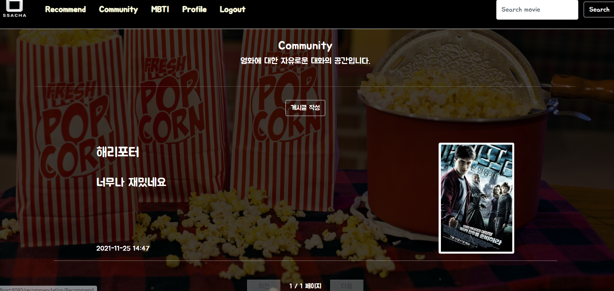

  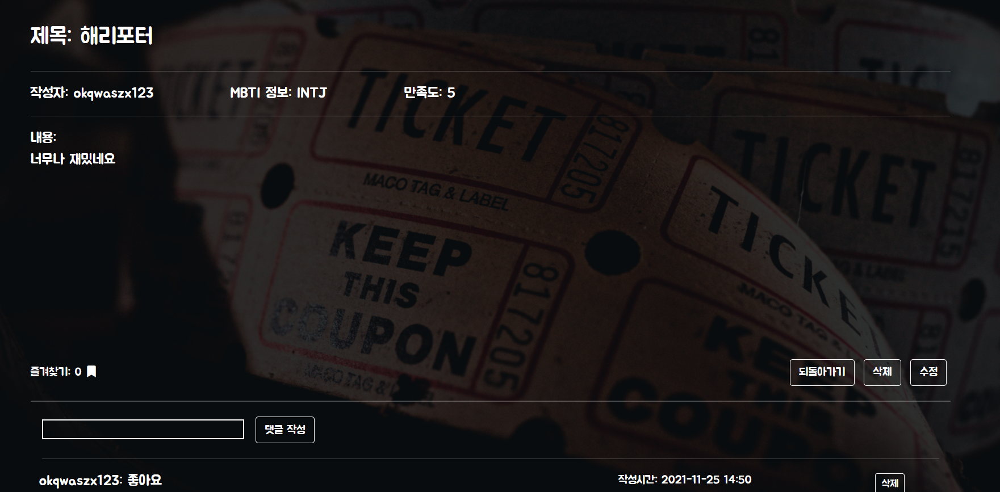		


- **프로필 페이지**

  기본적인 정보와 함께🎇

  - 내가 좋아요한 영화 

  - 내가 작성한 리뷰

  - 내가 작성한 게시글

  - 내가 즐겨찾기한 게시글

  확인 가능하도록 구현하였으며, 해당 영화 및 게시글로 갈 수 있는 링크를 설정하였고, 각 카테고리당 10개씩만 출력되도록 페이지네이션 설정 해 두었습니다.

  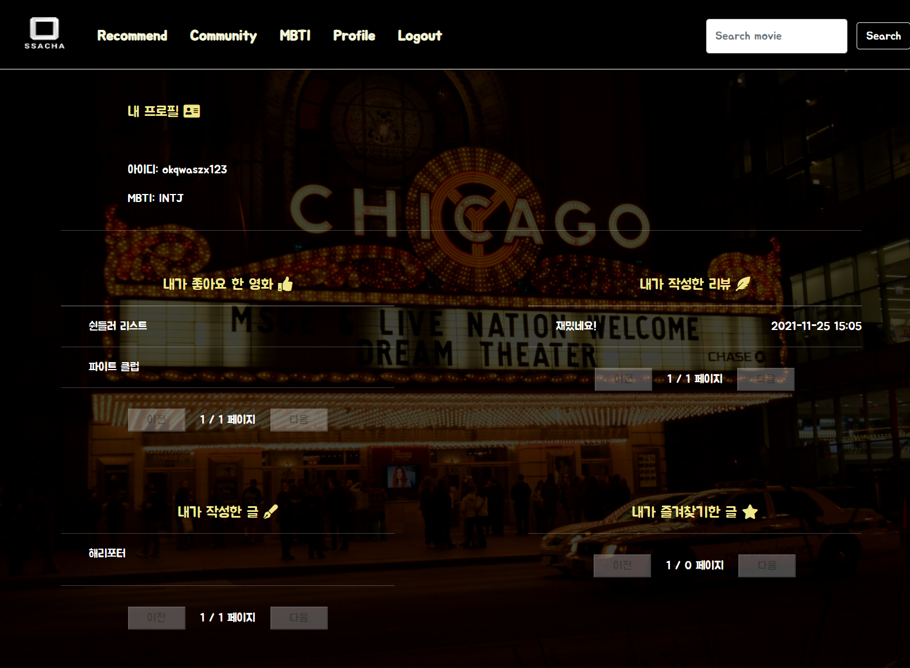

  

  

- **영화 검색 페이지**

  서치바를 이용한 단순 영화 검색결과 페이지입니다.

  서치바에 입력한 값이 영화 제목이 포함하고 있는 경우와   줄거리에 해당 값이 포함된 경우를 나누어 구현했으며,

  각 포스터를 클릭하면 상세페이지로 이동할 수 있도록 구현하였습니다.

  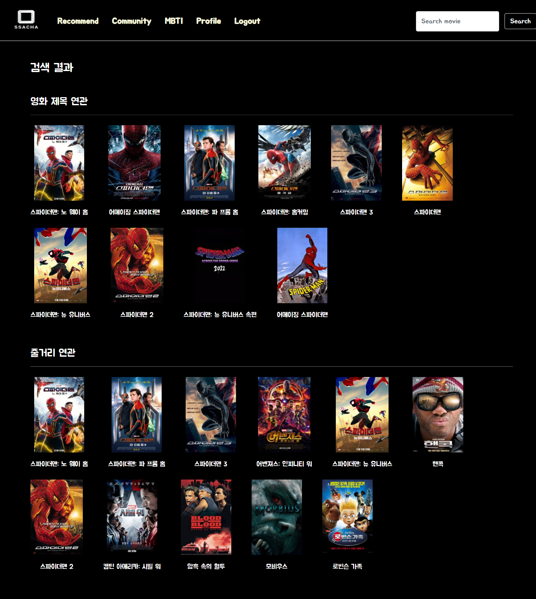

  

## 5. 프로젝트를 마친 소감

프로젝트를 마칠 때  '***\*연애편지를 쓰듯이 코딩해라\****' 라는 말이 제일 먼저 떠올랐습니다😍😥 


에러 메시지를 마주하면 작성한 코드를 의심하지 않고 컴퓨터💻의 상태를 의심하는 일이 종종 있습니다.  하지만, 시간을 가지고 코드를 꼼꼼하게 확인하면 항상 

문제는 저희의 코드에 있었습니다. 말 그대로, 컴퓨터는 거짓말을 하지않고 가변적이지 않으며 진솔하게 에러 메시지를 띄워주었습니다📑 

 컴퓨터가 거짓말 없이 일관된 모습을 보여주는 것처럼 저도 코드 한줄 한줄을 작성할 때 저의 의미와  목적을 정확하게 전달할 필요가 있다는 것을 느꼈습니다.

 어쩌면, 스파게티 코드 들과 무분별한 주석처리, 배려 없는 들여쓰기 등은 컴퓨터에게 상처를 주는 것도 같습니다💢

 그럼에도 우리의 코드를 보완해주고 문제가 있으면 친절하게 에러 메시지를 띄어주는 컴퓨터에게 감사함을 많이 느낀 프로젝트였습니다. 

나의 코드 한 줄의 목적과 의미를 정확하게 알고 코딩하는 습관을 통해 컴퓨터에게 배려가 넘치는

 ***\*연애편지\****를 작성하는 개발자가 되겠습니다.


다음으로 느낀 것은 ***\*사람의 중요성\****입니다✍   한 사람과 일주일이 넘는 시간을 공유하는 것은 항상 쉽지 않은 것 같습니다😂 

일주일의 기간동안 나도 모르게 실수를 할 수 있고,  그러한 실수들은 상대방에게 상처로 변질될 가능성도 있지만,  

이번 프로젝트 과정에서는 서로가 서로에게 모르는 것이 있으면 확실히 알아갈 수 있도록 침착하게 알려주고 서로가 어려워하는 부분이 있으면 

먼저 서로에게 손을 내미는 분위기였습니다.  덕분에, 수업에서 대충 넘어 갔던 부분들을 자세히 배우는 계기가 되었습니다💎 

컴퓨터에게 더 훌륭한 연애 편지를 작성할 수 있도록 도와주는 연애 전문가를  서로가 만난 느낌이였고, 

좋은 팀워크에 대해서 다시 한 번 생각해 볼 수 있는 계기가 되었습니다.

특히, 기획력 부분에서는 서로의 생각이 많이 일치하여 기획을 추진하는데 큰 동력이 되었습니다. 

둘다 MBTI에서 `xxTJ` 의 속성을 갖고 있어 날짜에 맞춰진 계획을 추구하는 성격이었고, 덕분에 이번 프로젝트는  시간적 여유가 많이 있었던 것 같습니다🎨  

결국 기획의 성공 여부는 기계, 기술력이 아닌 사람이 결정한다는 것을 많이 느꼈습니다.  

​	

한 한기를 마치며, 사실 **현업에 수준에 비해서는 많이 부족한 프로젝트 결과**라고 생각합니다.  

하지만, 프로젝트 진행 기간 동안 많은 것을 배우고 보완하고 알아갔기 때문에 

 ***\*나름의 자랑스러움이\**** ***\*담긴 프로젝트\****라고 생각합니다.

처음에는 이 정도 규모의 프로젝트를 직접 구현할 수 있을지 막막한 심정뿐이었습니다. 

하지만, 프로젝트를 성공적으로 끝마칠 수 있도록 120%의 힘을 발휘할 수 있는 과정을 제공해주신 싸피 교육에게 감사함을 느끼며,

저희가 이정도로 성장할 수 있게 도와주신 김준호 교수님께도 최고의 감사함을 전하고 싶습니다. 

당장 현업에서 쓸 수 있는 기술력을 보유하는 것보다 본인이 직접 공식 레퍼런스를 보고 생각하고 코드를 작성하며, 에러에 끙끙 대는 시간들이 소중했습니다.

감사합니다.


## 6. 배포 URL

* http://3.145.29.146:8080/

* SSACHA 팀 배포 URL입니다.
